## Arduino入門教學(14) – 以 Amarino 連接 Android 與 Arduino (作者：Cooper Maa)

編輯說明：[Amarino](http://www.amarino-toolkit.net/) 是 Android meets Arduino 的縮寫，
可以用 Android 手機來控制 Arduino 裝置，以下連結有 Cooper Maa 對 Amarino 的投影片介紹。

* [Getting Started with Amarino 簡報](http://coopermaa2nd.blogspot.tw/2012/07/getting-started-with-amarino.html)

這篇說明如何以 Amarino 通過藍芽連接 Android 與 Arduino，可作為 Amarino 入門的第一步

### 所需材料

* Android 手機一支
* Arduino x1
* bluetooth module x 1

### Step 1：安裝 Amarino

到 <http://www.amarino-toolkit.net/> 下載底下兩個 App 並安裝到 Android 手機上：

1) [Amarino](http://code.google.com/p/amarino/downloads/detail?name=Amarino_2_v0_55.apk&can=2&q=)

2) [Amarino Plug-in Bundle](http://code.google.com/p/amarino/downloads/detail?name=AmarinoPluginBundle.apk&can=2&q=)

### Step 2: 安裝 Arduino IDE 與 MeetAndroid Library

如果你電腦上還沒有 Arduino IDE，請先到 <http://arduino.cc/en/Main/Software> 下載軟體，下載後解壓縮即可。

接著下載 [MeetAndroid Library](http://code.google.com/p/amarino/downloads/detail?name=MeetAndroid_4.zip&can=2&q=) ，把 MeetAndroid 解到 Arduino IDE 安裝目錄的 libraries 資料夾下。

重新啟動 Arduino IDE，然後在 Sketch > Import Library 底下應該會看到 MeetAndroid，如下圖：

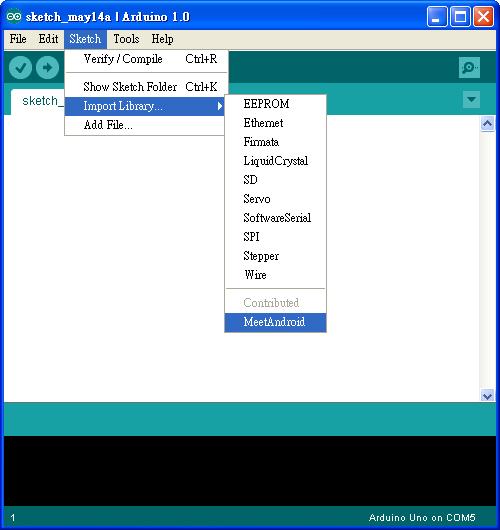

### Step 3： 上傳 Test 程式

點 File > Examples > MeetAndroid > Test 打開 Test 程式：

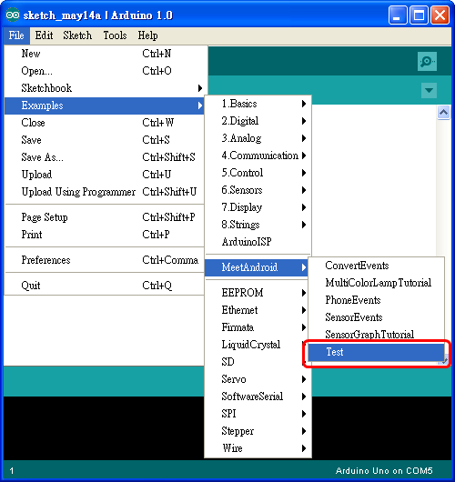

Test 程式所用的 baud rate 預設是 57600 bps，如果你的藍芽模組不是 57600 bps，請做適當的調整：

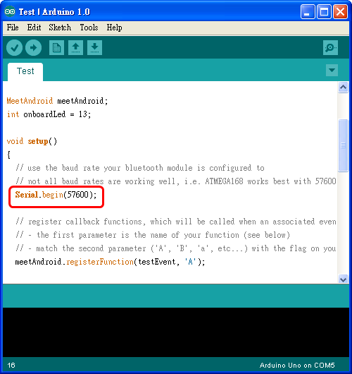

然後把程式上傳到 Arduino 板子上。

### Step 4：連接藍芽模組

我用的是 [廣州匯承信息科技](http://www.wavesen.com/) 的 HC-0x 系列藍芽模組，下圖是 HC-0x 藍芽模組的外觀：

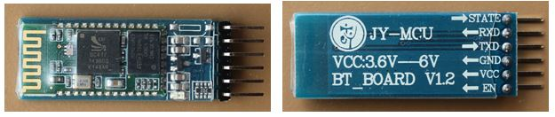

▲ HC-0x 藍芽模組 (圖左：正面圖，圖右：背面圖）

這個藍芽模組連接方法很簡單，只要照下表把 Arduino 和藍芽模組連接起來就好：

Arduino    藍芽模組    備註
-------    ---------   ---------------------------
5V         VCC         注意電源不可接錯
GND        GND         注意電源不可接錯
RXD        TXD         
TXD        RXD        

 
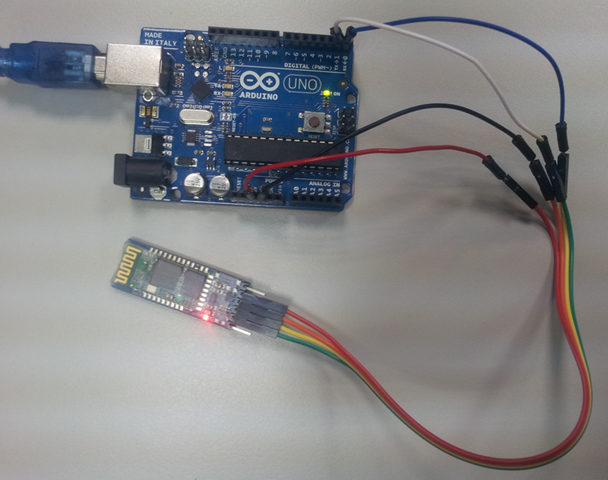

連接的時候有兩點要注意：第一是電源千萬不可接錯，不然藍芽模組可能會壞掉，第二是 Arduino 的 RXD 要接藍芽模組的 TXD，而 Arduino 的 TXD 要接藍芽模組的 RXD。

通電之後，藍芽模組上的 LED 會一直閃爍：

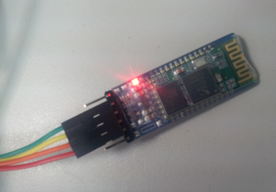

### Step 5：測試連線

打開 Android 手機上的 Amarino App，點擊【Add BT Device】（如下圖左）搜尋藍芽設備，如果藍芽模組有正確安裝，便會出現在列表中（如下圖右）：

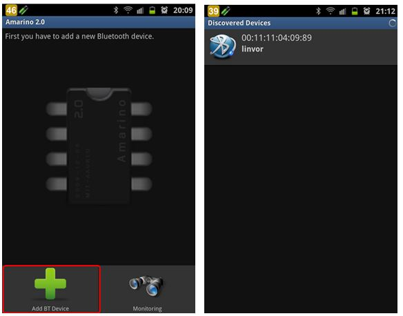

點選找到的藍芽設備，接著會進到設備列表：

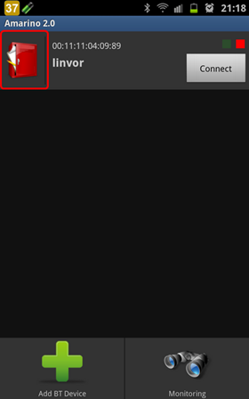

點一下上圖紅框框起來的圖示，接著點【Add Event】（如下圖左）顯示可用的 Events，然後點選【Test Event】（如下圖右）：

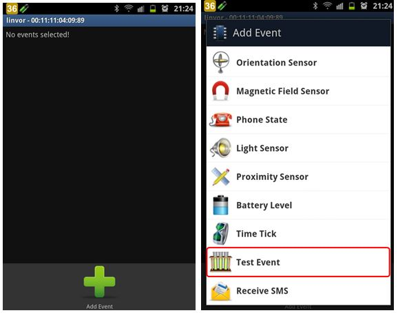

進入設定頁面後，直接點下面的【Save】鈕（如下圖左），此時藍芽設備已增加了一個 Test Event，如下圖右：

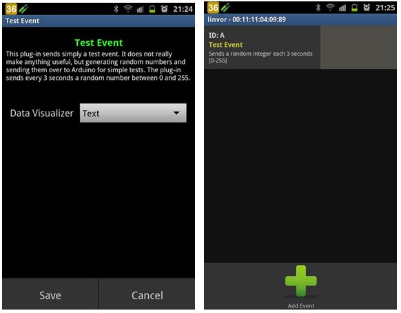

按下手機 Back 鍵回到設備列表畫面（如下圖左），點選【Connect】鈕跟 Arduino 連線，如果是第一次與此藍芽設備連線，Android 手機會出現「藍芽配對要求」的畫面，必須輸入配對密碼（一般為 0000 或 1234）才能與此藍芽設備連線（如下圖右）：

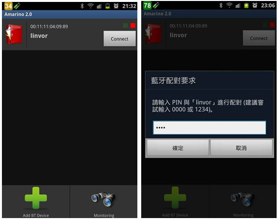

如果成功建立連線（如下圖），Amarino 便會每隔 3 秒發送一個數值介於 0 到 255 的 random number 給 Arduino，假如 Arduino 上的 LED 燈號（在 pin 13 上）會每隔 3 秒閃爍一下，那麼恭禧你，因為你的 Android 手機已經成功和 Arduino 建立通訊了。

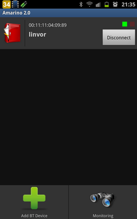

如果想知道 Amarino 背景在做什麼，可以點選【Monitoring】鈕以觀察背後的通訊過程：

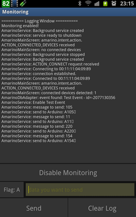

### 參考資料

* [How to connect my phone to Arduino in 10 steps](http://www.amarino-toolkit.net/index.php/getting-started.html)
* [Android talking to Arduino](http://www.chetanpatil.info/1/post/2011/12/android-talking-to-arduino.html)

【本文作者為馬萬圳，原文網址為： <http://coopermaa2nd.blogspot.tw/2012/06/amarino-android-arduino.html> ，由陳鍾誠編輯後納入本雜誌】

