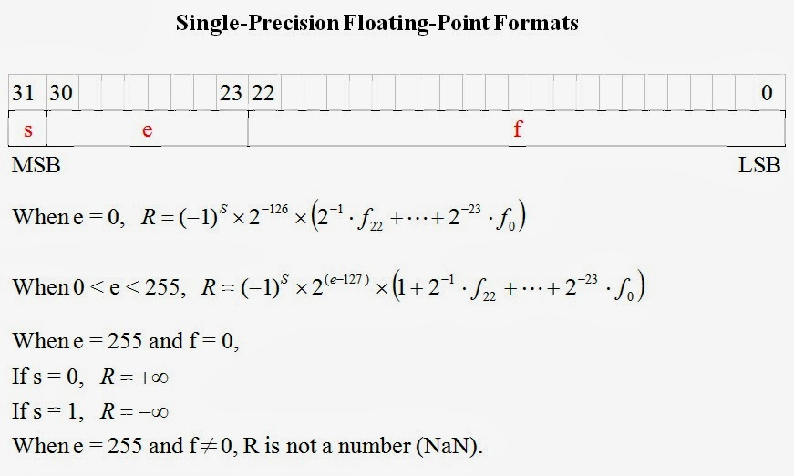
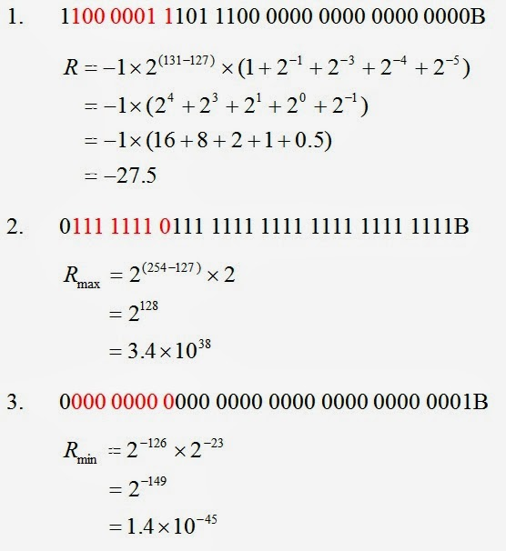
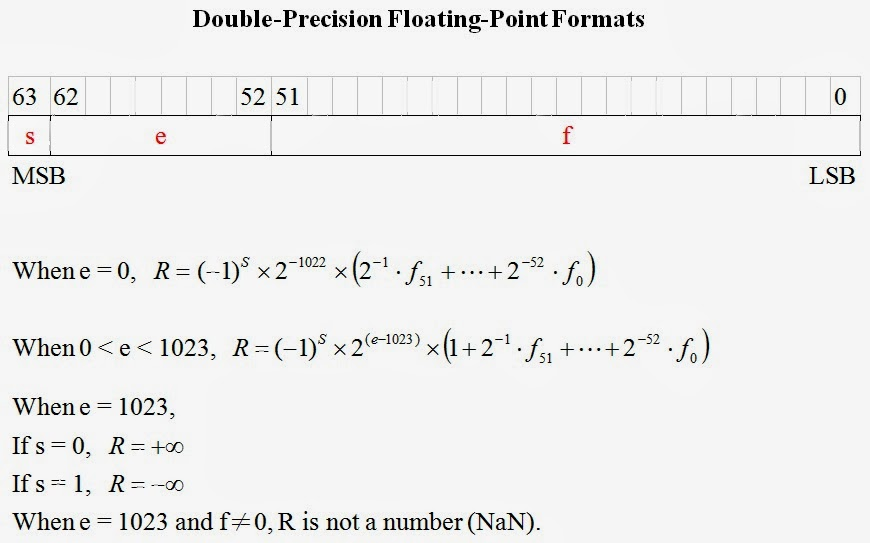

## 資料型態認識─浮點數 (single ＆ double) (作者：研發養成所 Bridan)

### 簡介

浮點數在電腦系統中是很重要的資料結構，很多程式設計者都知道有這樣的資料結構，但是清楚它的結構的人並不多，因為撰寫高階程式無需注意這些細節，只要會正確宣告變數型態，存在記憶體的資料不要有錯就好，況且高階語言的數學函數庫都很齊備，所以一般程式設計師根本碰不到這樣的問題。

常見二進制浮點數的宣告有兩種(IEEE-754,1985)：
單精準度 single (float)，32 bits，數值範圍 -3.4 x 1038 ～ +3.4 x 1038，最小的正數為 +1.4 x 10-45
雙精準度 double，64 bits，數值範圍 -1.80 x 10308 ～ +1.80 x 10308，最小的正數為 +4.94 x 10-324

標準請參見，

* [IEEE-754,1985](http://zh.wikipedia.org/zh-tw/IEEE_754) : binary floating point arithmetic standard specified
* IEEE-854,1987: standard expanded to include decimal arithmetic

接下來說明單精準浮點數資料格式(32 bits)，當你弄懂後，雙精準數值(64 bits)自然就可以自己推導。

*使用浮點數寫程式有兩種狀況要注意* ，

一、**有效位數** ─ 當你把二進制浮點資料轉換成十進制數值，需要注意它的有效位數，例如 single 有效位數只有六位，為什麼只有六位？自己想一想。

二、**尾數誤差** ─ 這是最常遇到的問題，如果引用數值經過計算或轉換後會產生尾數誤差，也就是十進制數值最後一位有效位數會誤差 ±1。例如，單精準 12.0000 會變成 12.0001，為什麼？如何解決？自己動腦想一想。

這些都是韌體工程師會遇到的數學難題。

(本文作者 研發養成所 Bridan，原文網址為 <http://4rdp.blogspot.tw/2010/03/signle-double.html> ，由陳鍾誠編輯後納入程式人雜誌)

