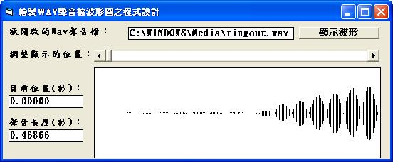

## [Visual Basic 6.0] 繪製WAV聲音檔波形圖之程式設計 (作者：廖憲得 0xde)

[Visual Basic 6.0] 繪製WAV聲音檔波形圖之程式設計
 
當遇到 WAV、BMP 等檔案處理問題時，就必須使用二進位讀檔。
 



```Monobasic
'# [Visual Basic 6.0] 繪製WAV聲音檔波形圖之程式設計
'# 0xDe

Dim WavByteArray(9999) As Byte
Dim DataE
Dim DataF
Private Sub Command1_Click()
Open Text1.Text For Binary As #1

Dim Inp As Byte

I = 0 ' 紀錄目前存放陣列數

Do While Not EOF(1)
    Get #1, , Inp
    WavByteArray(I) = Inp
    I = I + 1
Loop
    Close
' 因為題目說明說（表中數值為16進制數）所以將 16 進位轉換為 10 進位

' 判斷 00～03 Byte 是否為 "RIFF"
' 判斷 08～0E Byte 是否為 "WAVEfmt"
' 判斷 14～15 Byte 是否為 "0100"  表示PCM格式
' 判斷 16～17 Byte 是否為 "0100"  表示單聲道
' 判斷 22～23 Byte 是否為 "0800"  8位元
If ByteToData(&H0, &H3) = "RIFF" And ByteToData(&H8, &HE) = "WAVEfmt" And ByteData(&H14, &H17) = "1010" And ByteData(&H22, &H23) = "80" Then

' 取得 18～1B Byte 採樣頻率
' 取得 28～2B Byte 樣本數
DataF = 0 ' 頻率
DataE = 0 ' 樣本數

For I = 0 To 3
    DataF = DataF + 256 ^ I * WavByteArray(I + &H18)
    DataE = DataE + 256 ^ I * WavByteArray(I + &H28)
Next

Text3 = Format(DataE / DataF, "0.00000") ' 聲音長度
HScroll1.Min = &H2C ' 最小值為 資料開始
HScroll1.Max = HScroll1.Min + DataE  ' 最大值為 資料開始 + 聲音總樣本數

Else
    MsgBox "輸入的檔案名稱不是RIFF WAVEfmt PCM格式 8位元", 16, "輸入的檔案名稱：" & Text1
End If
End Sub

' Byte 轉換為 Data
Function ByteToData(ByteInp As Integer, ByteOut As Integer)
    Data = ""
For I = ByteInp To ByteOut
    Data = Data & Chr(WavByteArray(I))
Next I
    ByteToData = Data
End Function
' Byte 輸出
Function ByteData(ByteInp As Integer, ByteOut As Integer)
    Data = ""
For I = ByteInp To ByteOut
    Data = Data & WavByteArray(I)
Next I
    ByteData = Data
End Function

Private Sub HScroll1_Change()
        Picture1.Cls
        Picture1.Scale (0, 80)-(200, -80)
    For I = 0 To 200
        If HScroll1.Value + I <= HScroll1.Max Then
            Picture1.Line (I, (WavByteArray(HScroll1.Value + I) - 128))-(I, -(WavByteArray(HScroll1.Value + I) - 128))
        Else
            Picture1.PSet (I, 0)
        End If
    Next I
    
    Text2.Text = Format((HScroll1.Value - 44) / DataF, "0.00000") ' 目前秒數
End Sub
```

* 原始碼下載： [Visual Basic 6.0 繪製 Wav 波形.rar](http://files.dotblogs.com.tw/0xde/1312/2013124195539553.rar)

【本文作者為「廖憲得」，原文網址為： <http://www.dotblogs.com.tw/0xde/archive/2013/12/04/132528.aspx> ，由陳鍾誠編輯後納入本雜誌】
